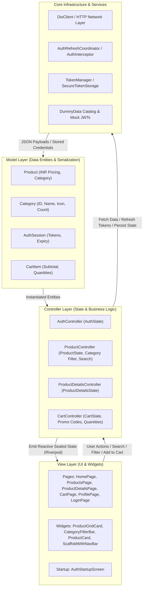

# ShopSphere - Project Overview & Technical Documentation (MVC Architecture)

> **Comprehensive guide to the architecture, features, data flow, API integrations, state management, design system, CI/CD pipeline, and automated test suites developed in ShopSphere.**

---

## 1. Executive Summary

**ShopSphere** is a production-grade, modular e-commerce mobile application developed with **Flutter** (Dart 3) and **Material 3**. The codebase is architected using **Feature-First Model-View-Controller (MVC)** principles, powered by **Riverpod 3.x** for controller state management and dependency injection, **GoRouter 14.x** with `StatefulShellRoute.indexedStack` persistent bottom navigation tabs (Home, Explore, Cart, Profile), and **Dio 5.x** for networking with concurrent token refresh coordination.

### Key Highlights
- **Architecture**: Feature-First MVC (`models/`, `views/`, `controllers/` per feature) providing high maintainability, clear separation of concerns, and zero unnecessary layer boilerplate.
- **State Management**: Flutter Riverpod (`Notifier` & `NotifierProvider.family` with sealed state unions for predictable UI state cycles).
- **Modernized UI & Design System**: Refreshed luxury visual language with tailored color palettes, elevation tokens, dark mode accents, responsive 2-column product catalog grid (`ProductGridCard`), and dynamic startup/splash flow (`AuthStartupScreen`).
- **Catalog Categorization & Discovery**: Dedicated `Category` domain model, horizontal `CategoryFilterBar` with real-time product count badges, search filtering, category-based featured products on Home, and related product recommendations on Product Details.
- **Currency Standardization**: Complete localization to Indian Rupees (₹ / INR) across catalog, details, cart, and discount calculation engines.
- **Resilient Networking**: Dio HTTP client with automatic JWT Bearer injection, queued 401 interceptor, and single-flight token refresh coordinator (`AuthRefreshCoordinator`).
- **Robust Error Mapping & Token Safety**: Comprehensive `DioErrorMapper` handling HTTP 400/401/403/404/422/429/500/502 status codes, paired with safe JWT decoding in `TokenManager` that gracefully handles corrupted/malformed tokens.
- **Secure Persistence**: Hardware-backed secure storage via `flutter_secure_storage` with automated JWT expiration checks (`jwt_decoder`).
- **CI/CD Automation**: GitHub Actions workflow (`.github/workflows/ci.yml`) enforcing code formatting, static analysis (`flutter analyze`), and test execution on main branch pushes and pull requests.
- **Multi-Environment Support**: Structured JSON configuration files for Development, Staging, and Production with full VS Code / Antigravity IDE launch and task integration.
- **Automated Test Coverage**: **83 automated unit, widget, and navigation tests** with 100% pass rate and 0 analysis issues.

---

## 2. Technology Stack & Dependencies

| Category | Package / Tool | Version | Purpose |
| :--- | :--- | :--- | :--- |
| **Framework** | Flutter SDK | `>=3.11.4` (tested on 3.41.6) | Cross-platform UI toolkit |
| **Language** | Dart SDK | `^3.11.4` | Strongly typed object-oriented language |
| **Architecture** | Feature-First MVC | N/A | High-velocity, modular, low-boilerplate structure |
| **State Management** | `flutter_riverpod` | `^3.3.2` | Reactive, compile-safe state management & DI for controllers |
| **Routing** | `go_router` | `^14.0.0` | Declarative routing with tabbed shell & auth redirect guards |
| **HTTP Client** | `dio` | `^5.11.1` | Network communication & interceptor pipeline |
| **Secure Storage** | `flutter_secure_storage` | `^11.2.0` | Keychain (iOS/macOS) & Keystore (Android) access |
| **JWT Utilities** | `jwt_decoder` | `^2.0.1` | Token payload decoding & expiry verification |
| **Icons** | `cupertino_icons` | `^1.0.8` | iOS & cross-platform style iconography |
| **Linting** | `flutter_lints` | `^6.0.0` | Standard Flutter static analysis rules |
| **Testing** | `flutter_test`, `mocktail` | `^1.0.5` | Unit, widget, and mocking test frameworks |
| **CI/CD** | GitHub Actions | `v4` | Automated CI pipeline for formatting, linting, and tests |

---

## 3. Project Architecture & Directory Structure

ShopSphere is organized into modular feature domains and shared core infrastructure:

```
shopsphere/
├── .github/
│   └── workflows/
│       └── ci.yml                        # GitHub Actions CI pipeline (format, analyze, test)
├── .vscode/
│   ├── launch.json                       # Multi-environment launch & debug configurations
│   └── tasks.json                        # VS Code build, test, and clean tasks
├── config/                               # Multi-environment configuration files
│   ├── development.json                  # Dev environment endpoints and flags
│   ├── staging.json                      # Staging environment configuration
│   └── production.json                   # Production environment configuration
├── lib/
│   ├── main.dart                         # Application entry point (ProviderScope root)
│   ├── app/                              # Top-level app configuration & composition
│   │   ├── app.dart                      # ShopSphereApp root widget & theme binding
│   │   ├── di/
│   │   │   └── app_dependencies.dart     # Dio client + AuthInterceptor DI wiring
│   │   ├── router/
│   │   │   ├── app_router.dart           # GoRouter route definitions & auth redirects
│   │   │   ├── auth_router_refresh.dart  # ChangeNotifier linking Riverpod auth state to GoRouter
│   │   │   └── scaffold_with_nav_bar.dart# Persistent bottom navigation shell with active badges
│   │   ├── startup/
│   │   │   └── auth_startup_screen.dart  # Animated splash / session restoration screen
│   │   └── theme/
│   │       ├── app_colors.dart           # Refreshed luxury color palette & tokens
│   │       └── app_theme.dart            # Material 3 ThemeData with custom component styles
│   ├── core/                             # Core cross-cutting infrastructure
│   │   ├── config/
│   │   │   ├── app_config.dart           # Compile-time environment resolution
│   │   │   └── app_environment.dart      # Environment enum (dev, staging, prod)
│   │   ├── errors/
│   │   │   ├── app_exception.dart        # Domain exception hierarchy
│   │   │   └── failure.dart              # Standardized failure value objects
│   │   ├── mock/
│   │   │   └── dummy_data.dart           # Categorized catalog (INR), promos & mock JWTs
│   │   ├── network/
│   │   │   ├── api_endpoints.dart        # Central API URI definitions
│   │   │   ├── auth_refresh_coordinator.dart # Single-flight concurrency-safe token refresher
│   │   │   ├── dio_client.dart           # Base Dio client configuration
│   │   │   ├── dio_error_mapper.dart     # Maps DioException (400-502) to AppException
│   │   │   ├── network_providers.dart    # Dio & DioClient Riverpod providers
│   │   │   └── interceptors/
│   │   │       └── auth_interceptor.dart # QueuedInterceptor for token injection & 401 retry
│   │   ├── result/
│   │   │   └── result.dart               # Sealed Result<T> (Success / Error) Monad
│   │   └── storage/
│   │       ├── secure_token_storage.dart # FlutterSecureStorage implementation
│   │       ├── storage_providers.dart    # Storage & TokenManager providers
│   │       ├── token_manager.dart        # Resilient JWT expiry logic & token lifecycle helper
│   │       └── token_storage.dart        # TokenStorage abstract interface
│   └── features/                         # Modular Feature Packages (MVC)
│       ├── auth/                         # Authentication Feature
│       │   ├── controllers/
│       │   │   └── auth_controller.dart  # AuthController & sealed AuthState
│       │   ├── models/
│       │   │   └── auth_session.dart     # AuthSession data model
│       │   └── views/
│       │       └── pages/
│       │           └── login_page.dart   # Luxury login screen UI with demo credentials
│       ├── cart/                         # Cart & Checkout Feature
│       │   ├── controllers/
│       │   │   └── cart_controller.dart  # CartController & CartState (INR calculations)
│       │   ├── models/
│       │   │   └── cart_item.dart        # CartItem data model with calculated subtotals
│       │   └── views/
│       │       └── pages/
│       │           └── cart_page.dart    # Cart UI with quantity modifiers & promo engine
│       ├── home/                         # Home & Discovery Feature
│       │   └── views/
│       │       └── pages/
│       │           └── home_page.dart    # Hero carousel, category chips & featured grid
│       ├── products/                     # Products & Catalog Feature
│       │   ├── controllers/
│       │   │   └── product_controller.dart # ProductController, ProductDetailsController & States
│       │   ├── models/
│       │   │   ├── category.dart         # Category domain model with standard mappings & counts
│       │   │   └── product.dart          # Unified Product model with category & INR price
│       │   └── views/
│       │       ├── pages/
│       │       │   ├── product_details_page.dart # Collapsible header, specs & related items
│       │       │   └── products_page.dart        # 2-column catalog grid with search & filter
│       │       └── widgets/
│       │           ├── category_filter_bar.dart  # Horizontal category chips with count badges
│       │           ├── product_card.dart         # Standard product card widget
│       │           └── product_grid_card.dart    # Luxury 2-column catalog grid card
│       └── profile/                      # User Profile Feature
│           └── views/
│               └── pages/
│                   └── profile_page.dart # VIP member banner, stats & settings menu UI
└── test/                                 # Complete automated test suite (83 tests)
    ├── widget_test.dart                  # App bootstrap smoke test
    ├── app/
    │   └── router/app_router_test.dart
    ├── core/
    │   ├── config/app_config_test.dart
    │   ├── mock/dummy_data_test.dart
    │   ├── network/
    │   │   ├── auth_interceptor_test.dart
    │   │   ├── auth_refresh_coordinator_test.dart
    │   │   └── dio_error_mapper_test.dart
    │   ├── result/result_test.dart
    │   └── storage/
    │       ├── secure_token_storage_test.dart
    │       ├── storage_providers_test.dart
    │       └── token_manager_test.dart
    └── features/
        ├── auth/
        │   ├── auth_controller_test.dart
        │   ├── auth_logout_test.dart
        │   └── login_page_test.dart
        ├── cart/
        │   └── cart_page_test.dart
        ├── home/
        │   ├── home_page_test.dart
        │   └── logout_navigation_test.dart
        ├── products/
        │   ├── category_feature_test.dart
        │   ├── product_catalog_grid_test.dart
        │   ├── product_controller_test.dart
        │   └── product_details_page_test.dart
        └── profile/
            └── profile_page_test.dart
```

---

## 4. MVC Component Design & Data Flow



---

## 5. Detailed Feature Breakdown

### 5.1. Authentication & Session Management (`lib/features/auth/` & `lib/app/startup/`)
- **Model (`AuthSession`)**:
  - Encapsulates `accessToken` and `refreshToken` with `fromJson` and `toJson` serialization.
- **Controller (`AuthController`)**:
  - Manages sealed `AuthState` union (`AuthInitial`, `AuthLoading`, `AuthAuthenticated`, `AuthUnauthenticated`, `AuthError`).
  - Key methods: `restoreSession()`, `login({email, password})`, `refreshSession({refreshToken})`, `logout()`.
  - Offline demo mode: Seamlessly authenticates demo credentials (`demo@shopsphere.com` / `password123`) when backend is unreachable.
- **Token Resilience (`TokenManager`)**:
  - Safe JWT decoding with try-catch guarding against corrupted tokens or malformed payload formats.
  - Expiry evaluation and proactive token lifecycle management.
- **Views**:
  - `AuthStartupScreen`: Premium animated splash screen checking token validity during cold launch before smooth navigation.
  - `LoginPage`: Redesigned luxury interface with email/password validation, fast demo-fill shortcut, and SnackBar error handling.

### 5.2. Products, Categories & Catalog Engine (`lib/features/products/`)
- **Models**:
  - `Category`: Categorization model supporting standard buckets (`All`, `Electronics`, `Fashion`, `Footwear`, `Accessories`, `Lifestyle`), icon resolution, and dynamic product counting.
  - `Product`: Unified catalog entity with `id`, `title`, `description`, `price` (in ₹), `imageUrl`, and `category`.
- **Controllers**:
  - `ProductController`: Manages `ProductState` (`ProductInitial`, `ProductLoading`, `ProductLoaded`, `ProductError`), selected category filtering, real-time search queries, dynamic item count calculation per category, and offline dummy fallback.
  - `ProductDetailsController`: Family notifier managing details state keyed by `productId`.
- **Views & Components**:
  - `ProductsPage`: 2-column responsive grid layout with instant search bar and category filter chips.
  - `ProductGridCard`: Modern luxury card with image aspect ratio, discount badges, star ratings, INR pricing, and direct "Add to Cart" action.
  - `CategoryFilterBar`: Horizontally scrollable chip selector with active pill styling and item count badges.
  - `ProductDetailsPage`: Collapsible sliver header with image view, category badge, rating breakdown, quantity stepper, specifications, and related products recommendation carousel.

### 5.3. Cart & Promo Engine (`lib/features/cart/`)
- **Model (`CartItem`)**:
  - Represents cart lines with `id`, `title`, `price` (INR), `imageUrl`, `quantity`, and computed `subtotal`.
- **Controller (`CartController`)**:
  - Manages `CartState` (items list, promo code, discount percentage, subtotal, discount amount, grand total).
  - Methods: `addProduct(product, {quantity})`, `updateQuantity(id, quantity)`, `incrementQuantity(id)`, `decrementQuantity(id)`, `removeItem(id)`, `clearCart()`, `applyPromo(code)`, `removePromo()`.
  - Built-in promo codes: `TECH40` (40% OFF), `STYLE20` (20% OFF).
- **View (`CartPage`)**:
  - Redesigned cart cards with swipe-to-remove, quantity steppers, promo code entry with visual feedback, order breakdown summary card, and empty cart state.

### 5.4. Home & Discovery (`lib/features/home/`)
- **View (`HomePage`)**:
  - Search trigger leading directly to catalog.
  - Hero promotional banner carousel (`DummyData.promoBanners`).
  - Interactive horizontal category filter chips.
  - 2-column featured products grid dynamically reacting to category selection.
  - Quick add-to-cart actions directly from the home feed.

### 5.5. Profile & Settings (`lib/features/profile/`)
- **View (`ProfilePage`)**:
  - VIP Member tier card with user avatar and email.
  - Quick account stats (Orders, Wishlist, Coupons).
  - Categorized menu tiles (My Orders, Saved Addresses, Payment Methods, Push Notifications, Help & Support, Privacy Policy).
  - Logout trigger with confirmation dialog and state reset.

### 5.6. Core Infrastructure & Networking (`lib/core/`)
- **Network Pipeline**:
  - `DioClient`: Configured Dio instance with timeout settings and interceptors.
  - `AuthInterceptor`: `QueuedInterceptor` automatically injecting Bearer tokens and intercepting 401 responses.
  - `AuthRefreshCoordinator`: Concurrency-safe, single-flight refresh manager ensuring only one refresh API call occurs across simultaneous requests.
  - `DioErrorMapper`: Maps Dio error types and HTTP status codes (400, 401, 403, 404, 422, 429, 500, 502) to strongly typed domain exceptions.
- **Result Monad**: Sealed `Result<T>` with `Success<T>` and `Error<T>` for safe, functional error handling.

### 5.7. App Shell, Theming & Navigation (`lib/app/`)
- **Theme (`AppTheme` & `AppColors`)**:
  - Material 3 theme configuration with custom luxury palette, typography, card shapes, input decoration, and button styles.
- **Routing (`AppRouter` & `ScaffoldWithNavBar`)**:
  - Declarative GoRouter routing with `StatefulShellRoute.indexedStack`.
  - Persistent bottom navigation preserving tab state across Home, Explore (Products), Cart, and Profile.
  - Reactive auth redirect guards checking `AuthState` via `AuthRouterRefreshNotifier`.

---

## 6. Testing & Quality Assurance Summary

The automated test suite consists of **83 automated unit, widget, and integration tests** executing in under 10 seconds:

```
00:08 +83: All tests passed!
```

### Test Suite Breakdown:

| Test File | Target Component | Scenarios Verified |
| :--- | :--- | :--- |
| `app_router_test.dart` | GoRouter Navigation | Unauthenticated redirect to login, auth state changes, deep navigation |
| `auth_controller_test.dart` | AuthController | Login success, token saving, offline fallback, session restoration |
| `auth_logout_test.dart` | AuthController & Storage | Token clearing, state transition to unauthenticated on logout |
| `login_page_test.dart` | LoginPage Widget | Form validation, demo quick-fill, loading indicators, login submission |
| `product_controller_test.dart` | ProductController | Catalog fetching, category filtering, search queries, dummy fallback |
| `category_feature_test.dart` | Category & FilterBar | Category mapping, count calculations, filter chip rendering and clicks |
| `product_catalog_grid_test.dart` | ProductGridCard Widget | 2-column grid rendering, price display (₹), add-to-cart callback |
| `product_details_page_test.dart` | ProductDetailsPage Widget | Header image, specs, quantity updates, add-to-cart, related items |
| `home_page_test.dart` | HomePage Widget | Banners, category chips, featured grid rendering, navigation triggers |
| `logout_navigation_test.dart` | End-to-End Navigation | End-to-end router navigation after logout action |
| `cart_page_test.dart` | CartPage & Controller | Item listing, quantity modifiers, promo code application, totals |
| `profile_page_test.dart` | ProfilePage Widget | VIP tier banner, account stats, settings tiles, logout dialog |
| `auth_interceptor_test.dart` | AuthInterceptor | Bearer injection, 401 intercept, token refresh retry, duplicate prevention |
| `auth_refresh_coordinator_test.dart` | AuthRefreshCoordinator | Single-flight execution, concurrency deduplication, failure sharing |
| `dio_error_mapper_test.dart` | DioErrorMapper | HTTP 400, 401, 403, 404, 422, 429, 500, 502 status code mappings |
| `token_manager_test.dart` | TokenManager | Token validation, expiry parsing, malformed JWT resilience |
| `token_storage_test.dart` | TokenStorage | Saving, reading, clearing access and refresh tokens |
| `storage_providers_test.dart` | Storage DI Providers | SecureTokenStorage provider resolution |
| `dummy_data_test.dart` | DummyData Mock Set | Catalog integrity, INR pricing, category mappings, mock JWT validity |
| `app_config_test.dart` | AppConfig | Multi-environment resolution (dev, staging, prod) |
| `result_test.dart` | Result Monad | Success and Error branching, value/failure extraction |
| `widget_test.dart` | App Smoke Test | Root widget initialization and rendering |

---

## 7. CI/CD & Developer Tooling

### 7.1. GitHub Actions Workflow (`.github/workflows/ci.yml`)
ShopSphere runs an automated CI workflow on every push and pull request targeting `main`:
1. **Environment Setup**: Provisions Ubuntu runner with Flutter SDK `3.41.6` (stable).
2. **Dependency Resolution**: Runs `flutter pub get`.
3. **Format Verification**: Checks code formatting with `dart format --set-exit-if-changed .`.
4. **Static Analysis**: Runs `flutter analyze` with 0 allowable warnings or errors.
5. **Automated Testing**: Executes `flutter test` across all 83 test suites.

### 7.2. VS Code & Antigravity IDE Integration
Configurations in `.vscode/` enable zero-friction developer workflows:
- **Run & Debug (`launch.json`)**:
  - `ShopSphere (Development - Debug)`: Runs with `config/development.json`.
  - `ShopSphere (Staging - Debug)`: Runs with `config/staging.json`.
  - `ShopSphere (Production - Debug)`: Runs with `config/production.json`.
  - `ShopSphere (Run All Tests)`: Executes test suite in debugger.
  - `ShopSphere (Run Tests with Coverage)`: Executes tests with coverage collection.
- **Tasks (`tasks.json`)**:
  - `flutter: analyze`: Code analysis.
  - `flutter: test`: Run test suite.
  - `flutter: test (with coverage)`: Run tests with lcov report.
  - `flutter: clean & pub get`: Clean rebuild workflow.

---

## 8. Running & Testing Instructions

### Via Command Line:

```bash
# 1. Install dependencies
flutter pub get

# 2. Check code formatting
dart format --output=none --set-exit-if-changed .

# 3. Run static analysis (0 errors, 0 warnings)
flutter analyze

# 4. Execute test suite (83 tests passing)
flutter test

# 5. Run application by environment
# Development
flutter run --dart-define-from-file=config/development.json

# Staging
flutter run --dart-define-from-file=config/staging.json

# Production
flutter run --dart-define-from-file=config/production.json
```

---

*Documentation updated to reflect the latest Feature-First MVC architecture, category discovery engine, refreshed design system, CI/CD pipeline, and expanded test suite.*
